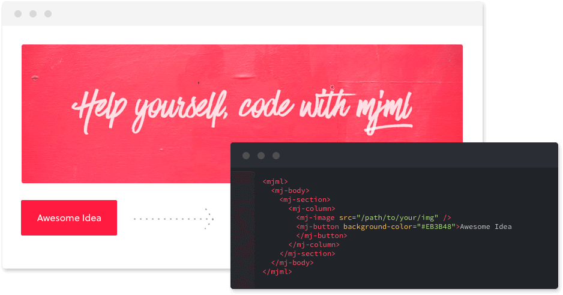
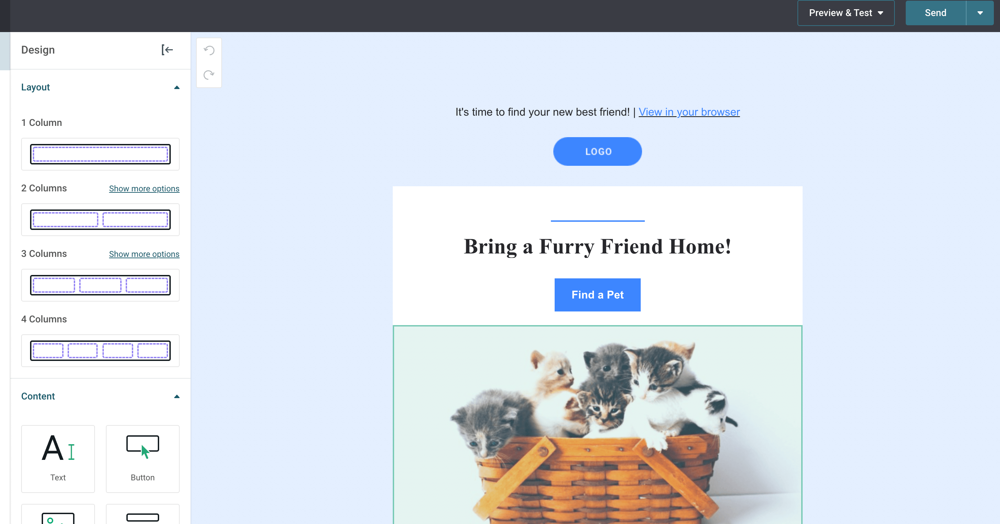
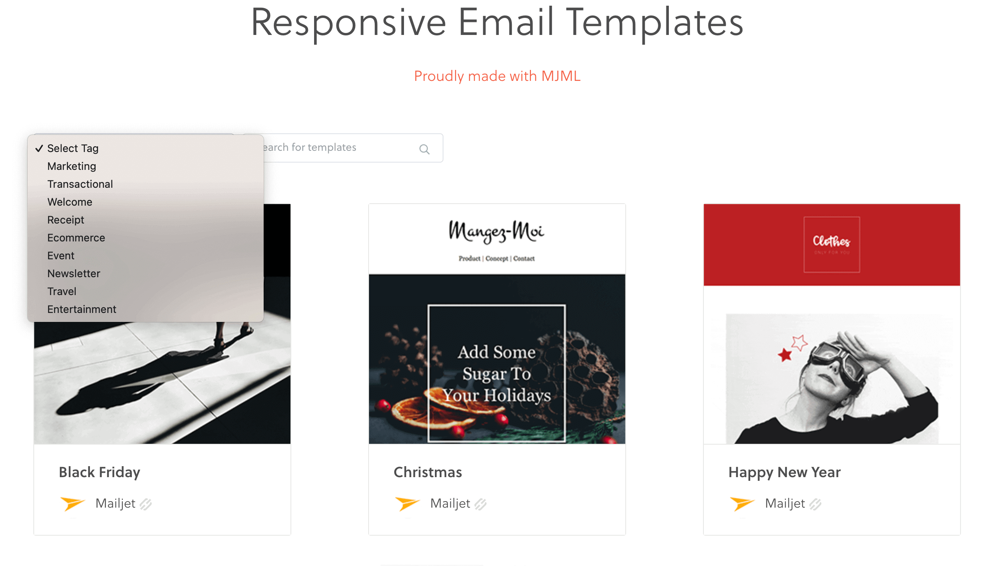

# 快速制作出响应式邮件的框架 Mjml

[Mjml](https://github.com/mjmlio/mjml) 是一个能够快速制作出响应式邮件的框架。通过该项目可以让邮件正常的显示在不同的客户端中。项目提供了[非常多的组件](https://documentation.mjml.io/#standard-head-components)。

项目提供了更加友好的 [在线编辑器](https://demo.mailjet.com/).

项目同时也提供了[各色的模版](https://mjml.io/templates)。

