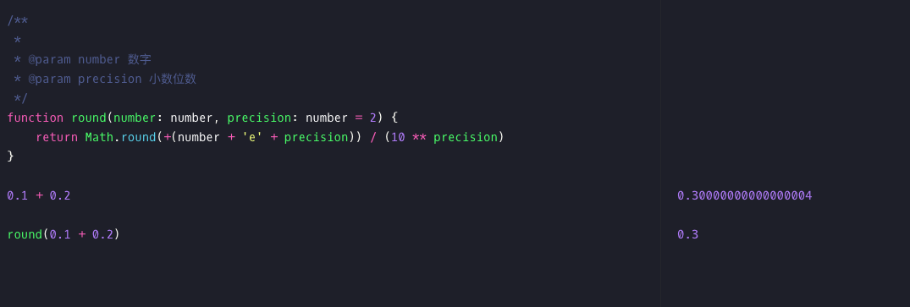
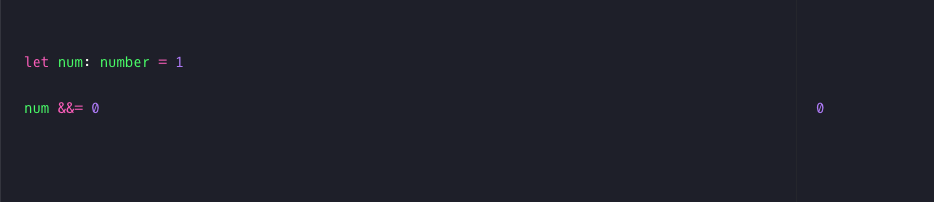
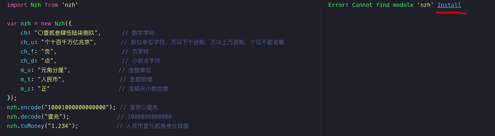

# 快速调试编辑器 RunJS

> 工欲善其事，必先利其器

随着前端开发的发展更迭，前端日常开发工作变得愈发复杂愈发深入，同时前端工程中从项目初始化、编译、构建到发布、运维也变得细化而成熟。日常前端工作的每个环节都涌现出丰富的工具、服务和解决方案来解决工程效率的问题。

在需要快速调试的情况下，我推荐开发工具 [RunJS](https://runjs.app/) 。

RunJS 一个用作 JavaScript 暂存器的桌面应用程序。这是我最喜欢的用于快速调试和测试事物的工具。

RunJS 适合代码段的开发和使用。默认我们就可以直接使用 ts，babel。

我们可以在上面自由的实验新 api:

当我们面临新的 js 库（非 UI 库）时，当前编辑器会提示我们

再点击安装之后： 

RunJs 编辑器可以迅速的进行代码测试，提供正向反馈
- 新库测试与使用
- 算法调试
- JavaScript 代码的讲解以及教学

更新时间: {docsify-updated}

