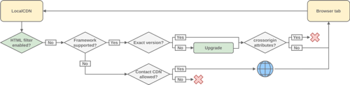
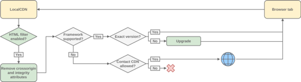
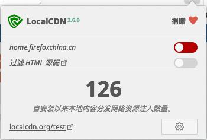

# LocalCDN 插件提升网站加载速度

一个有追求的开发人员对性能总是不满足的。

对于加载资源，我们可以借助 CDN 来提升网络速度。但是 CDN 还是依赖于网络，可能还会有一些开发者并不满意。

[LocalCDN](https://www.localcdn.org/) 是一款浏览器扩展工具，主要为 Mozilla 的 Firefox 浏览器开发。尽管插件也可用于基于 Chromium 内核的浏览器，但是有些功能仅在 Firefox 才能使用。

LocalCDN 插件通过劫持注入 CDN 资源以便提升速度。没错，如果我们把很多网络资源放在本地（插件中），那么网站的速度将会再次提升一个档次(当前插件不针对个人开发网站，而是浏览的所有使用公用 cdn 的网站)。

第一时间在 Firefox 浏览器安装好插件后，我就尝试加载网站，但很可惜，在某些网站上浏览器显示一片空白。

在查询文档后发现，虽然 LocalCDN 可以劫持请求，但是 HTML 源代码中某些选项会禁止这一切。如 

- crossorigin   
  crossorigin 强制浏览器忽略其他源。

- integrity   
  integrity 为当前 js 库提供 hash 值来匹配，但插件仅仅提供最新的 cdn，因此该属性也不可使用。

这种情况下，我们必须在 script 中去除这两个属性。事实上，有且仅有火狐浏览器支持 [webRequest.filterResponseData](https://developer.mozilla.org/en-US/docs/Mozilla/Add-ons/WebExtensions/API/webRequest/filterResponseData) 接口，LocalCDN 通过该接口读取 HTML 源代码，然后在浏览器显示时删除这些属性。

我们只需要在插件中打开 "过滤 HTML 源码" 开关即可。

我们可以在此对比一下是否 html 过滤流程：

没使用 HTML 过滤时候

使用 HTML 过滤时候

但在其他浏览器中，是没有办法过滤 HTML 源码的。所以我们能做的是关闭当前网站的插件使用。

玩的开心， ⚠️ 注意安全！

更新时间: {docsify-updated}

