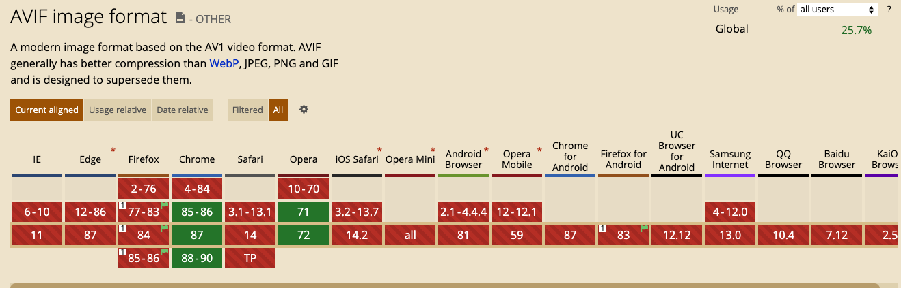

## AVIF 图片格式

一图胜千言，在实际的开发中，更加优秀的图片格式无疑会减少传输量，加快性能。

之前如果有图片开发，往往我们在实际使用图片时候都会使用 tinypng 来对图片进行压缩。

AVIF（AV1 Image File Format，AV1图像文件格式）是目前最值得关注的新型图片格式。AVIF是业界最新的开源视频编码格式AV1的关键帧衍生而来的一种新的图像格式。

Netflix(著名的流媒体影视公司) 在 2020 年情人节公布 AVIF 图片格式。AVIF 图片格式由开源组织 AOMedia 开发，Netflix、Google 与 Apple 均是该组织的成员, 所以当前格式也是非常值得期待。

当然，如果浏览器是这种支持情况，今天没有情况。

使用AV1 polyfill：

- Chrome 57+
- Firefox 53+
- Edge 17+
- Safari 11+

我对新格式的可能性感到兴奋，并且稍微看了一下一些比我聪明得多的人的分析，看看是怎么回事。我看到的第一篇文章是 Daniel Aleksandersen 的 AVIF vs WebP，发现在 JPEG 的基线上，文件大小的中位数减少了50.3% ，而 WebP 的减少了31.5% 。同样地，杰克 · 阿奇博尔德对一辆 f 1赛车的照片做了一个很好的比较，其中 WebP 占57.7% ，AVIF 占18.2% ，令人印象深刻。

Sharp 最近在他们的 Node.js 库中合并了对 AVIF 的支持

更新时间: {docsify-updated}

