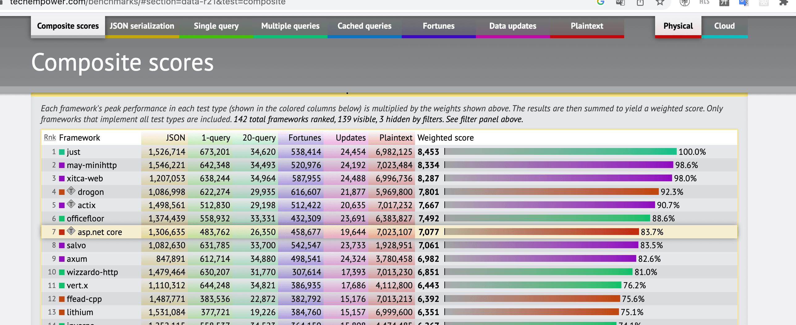

# 高性能的 JavaScript 运行时 just-js

Techempower 排名自 2013 年开始运行，可以作为平台或语言运行性能的参考。

根据 [Techempower 第 21 次排名](https://www.techempower.com/benchmarks/#section=data-r21&test=composite) 来看，[just-js](https://github.com/just-js/just) 为止在第一位。

作为一个 JavaScript 运行时，能达到第一名是一件非常难以置信的事。当然作者本身也做了很多的黑科技。这里是作者自己写了一片博客解释为什么 just-js 可以那么快！原文为 [Why is Javascript in the top 2 of techempower?](https://just.billywhizz.io/blog/on-javascript-performance-01/)。

目前来看，开发者可以利用 just-js 做一些 cpu 密集型的工作（目前不建议在企业中使用）。