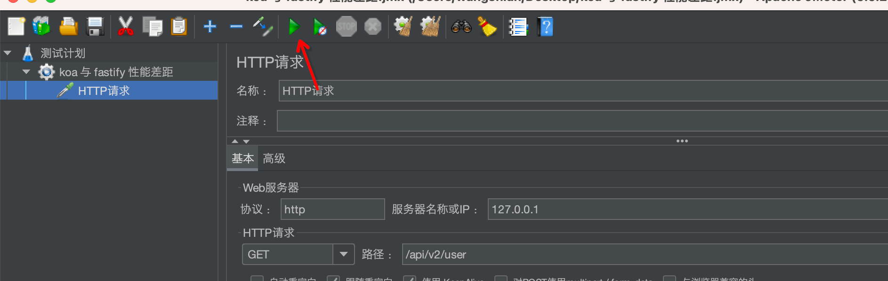

# 服务端性能测试工具 JMeter

软件测试中：压力测试（Stress Test），也称为强度测试、负载测试。压力测试是模拟实际应用的软硬件环境及用户使用过程的系统负荷，长时间或超大负荷地运行测试软件，来测试被测系统的性能、可靠性、稳定性等。

压力测试的指标以及对应的含义：
	
|  指标   | 含义 |
|  ----  | ----  |
| 响应时间(RT)  | 系统对请求作出响应的平均时间 |
| 吞吐量  | 系统在单位时间内处理的数量 |
| 资源利用率  | CPU占用率, 内存使用率, 系统负载, 网络IO |
| 并发用户数  | 系统可以同时承载的正常使用系统功能的用户的数量 |
| 错误率  |  失败请求占比 |

而评价系统主要考虑 3 个指标：RT, 吞吐量以及资源利用率。


上图充分的展示了响应时间, 吞吐量, 利用率和并发用户数之间的关系。

从上图可以看到，随着并发用户数逐渐增高，系统会有如下情况：
- 系统进入轻负载(Light Load)，逐渐达到最优并发数。此时系统利用率高,吞吐量高, 响应时间短
- 系统进入重负载(Heavy Load)时,吞吐量逐渐增加，响应时间也逐渐增加
- 超过某个临界值后，进入塌陷区（Buckle Zone）。此时系统的响应时间会急剧增加, 吞吐量急速下降

系统进行压测的目的就是测试出系统对应的临界值。这里我们使用 JMeter 作为压力测试工具。

[JMeter](https://jmeter.apache.org/) 是 Apache 组织开发的基于 Java 的压力测试工具。用于对软件做压力测试，它最初被设计用于 Web 应用测试，但后来扩展到其他测试领域。它可以用于测试静态和动态资源，例如静态文件、Java 小服务程序、CGI 脚本、Java 对象、数据库、FTP 服务器等等。

## 安装与配置

JMeter 需要 java 8 以上的版本。所以需要先安装 Java 工具包。

然后[下载 jMeter](https://jmeter.apache.org/download_jmeter.cgi) 5.6.2 二进制版本。

下载的文件夹如下所示。


此时进入 bin 文件夹就可以运行 jmeter 文件来进行测试，但是对应的语言界面是英文的。开发者可以通过修改 jmeter.properties 文件更改界面为中文。


在文件中找到 language 一行。

```bash
#language=en
```

去除注释 # 同时改为 zh_CN 就可以使用中文界面了。

```bash
language=zh_CN
```

## 基本使用

JMeter 有两种使用方式：

- GUI：图形用户界面运行模式，可视化，更加直观，使用鼠标操作，方便实时查看运行状态，如测试结果、运行线程数等
- 非 GUI：命令行模式，对负载机的资源消耗更小，GUI 模式会影响负载量的生成，比如非 GUI 模式 100 个线程可以产生 100 TPS 的负载，而 GUI 模式只能产生 80TPS 的负载

所以，开发者应该使用 GUI 模式配置测试方案，使用非 GUI 模式执行测试。

先打开上图中 jmeter 文件就会出现图形界面：


先新建一个线程组。


新建线程组之后界面如下所示。


这里可以修改线程组名称，以及配置请求逻辑：

- 线程数: 虚拟的用户数, 一个用户占一个线程
- 循环次数: 单个线程发送请求的次数
- Ramp-Up: 等待时间, 设置的虚拟用户(线程数)需要多长时间全部启动
- 调度器:
    - 持续时间: 该任务执行的时间
    - 启动延迟: 等待多少秒开始执行

此时配置线程数 200，执行次数 10 次。Ramp-Up 1 秒。

配置线程组后，可以添加 HTTP 请求配置。


下图直接配置对应的设置，翻译很好，不需要太多解释。


执行测试。



但是这时候什么数据都看不到，需要添加监听器方便我们查看和分析数据。


添加一下结果树。


结果树中列出了每一次的HTTP请求, 绿色的是成功, 红色的话就是失败

请求结果参数详解：

- Thread Name：线程组名称
- Sample Start: 启动开始时间
- Load time：加载时长
- Latency：等待时长
- Size in bytes：发送的数据总大小
- Headers size in bytes：发送数据的头部大小
- Response code：返回码
- Response message：返回信息

但此时只要服务端返回状态码为 200。jMeter 就会认为当前请求是成功的。这里有可能不符合当前系统的业务逻辑。开发者可以添加断言来判断对应 API 的成功和失败。这里使用断言故意设置错误的返回值。


编写时候注意不要有空格，此时再执行一遍测试，结果如下所示：


这里还可以添加了聚合报告以及图形结果。


开发者还可以在整个测试计划中添加断言和监听器以便分析多个 HTTP 请求。


再离开界面前 jMeter 会提示是否保存当前测试？直接保存 jmx 文件即可。


然后我们后续可以执行 jmx。

```bash
jmeter -n -t ./koa\ 与\ fastify\ 性能差距.jmx -l temp.jtl -e -o report
```

- n cli 模式执行 jMeter 测试
- t 需要运行的 jmx 文件
- l 记录执行过程的日志文件
- e 测试结束后生成测试报告
- o 指定测试报告的位置，需要填写一个不存在的文件夹
