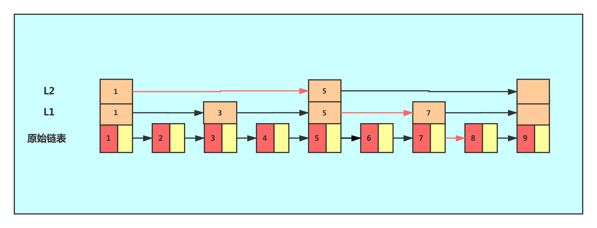

## 1. 什么是跳表？

跳表（Skip List）是一种基于概率的数据结构，由 William Pugh 在1989年的论文《Skip Lists: A Probabilistic Alternative to Balanced Trees》中首次提出。它通过在有序链表的基础上，维护多层索引结构，从而实现对数级别的查找、插入和删除操作。跳表的核心思想是"空间换时间"，通过增加索引层来减少查找时需要遍历的节点数量。



### 1.1 跳表的核心特性

- **高效性**：查找、插入和删除操作的平均时间复杂度均为 O(log n)
- **实现简单**：相比平衡树（如红黑树、AVL树），实现更加简洁直观，无需复杂的旋转操作
- **随机性**：通过随机化技术来构建索引层级，保证数据结构的平衡性
- **空间开销**：平均空间复杂度为 O(n)，略高于普通有序链表
- **顺序访问**：支持高效的顺序访问和范围查询
- **并发友好**：相比平衡树，更容易实现高效的并发操作

### 1.2 跳表与其他数据结构的对比

| 数据结构 | 查找复杂度 | 插入复杂度 | 删除复杂度 | 实现复杂度 | 并发支持 | 适用场景 |
|---------|-----------|-----------|-----------|-----------|---------|---------|
| 跳表 | O(log n) 平均 | O(log n) 平均 | O(log n) 平均 | 简单 | 较好 | 有序集合、范围查询 |
| 红黑树 | O(log n) 最坏 | O(log n) 最坏 | O(log n) 最坏 | 复杂 | 较差 | 严格要求性能的场景 |
| 有序链表 | O(n) | O(n) | O(n) | 简单 | 一般 | 数据量小、写操作少 |

## 2. 跳表的工作原理

跳表通过在有序链表的基础上构建多层索引，从而实现类似二分查找的高效检索性能。下面详细介绍其工作原理：

### 2.1 层级结构

跳表由多层链表组成，每一层都是一个有序链表：

- **底层链表（Level 0）**：包含所有元素的完整有序链表
- **索引层（Level 1 及以上）**：每一层都是对下层的"快速路径"，越往上的层级，包含的节点越少
- **头节点**：一个特殊的哨兵节点，不包含实际数据，用于指向每一层的第一个节点
- **最大层级**：跳表中最高的索引层级

在理想情况下，每向上一层，节点数量大约减少一半，形成类似二叉树的结构，但实际上由于是随机生成层级，所以会有一定的偏差。

### 2.2 查找过程

跳表的查找过程类似于二分查找，但通过索引层进行快速跳转：

1. 从最高层的头节点开始
2. 在当前层级向右移动，直到下一个节点的值大于或等于目标值
3. 此时，目标值如果存在，必然在当前节点的正下方或右下方
4. 下降到下一层，重复步骤2-3
5. 到达最底层后，如果下一个节点的值等于目标值，则查找成功；否则，目标值不存在

这种查找方式大大减少了需要遍历的节点数量，平均时间复杂度为 O(log n)。

### 2.3 随机层级生成

跳表的平衡性通过随机层级生成算法来保证：

- 每个节点在创建时，会随机生成一个层级
- 层级生成遵循概率分布，通常有 p（如0.5）的概率增加一层
- 数学上可以证明，当 p=0.5 时，跳表的期望高度为 O(log n)
- 节点的层级决定了它在哪些索引层中出现

随机层级生成的伪代码如下：

```
function randomLevel():
    level = 1
    // 有50%的概率增加一层，直到达到最大层级
    while (random() < 0.5 and level < MAX_LEVEL):
        level += 1
    return level
```

### 2.4 节点分布的数学原理

在理想情况下，跳表中节点的层级分布遵循几何分布：

- 约50%的节点只有1层
- 约25%的节点有2层
- 约12.5%的节点有3层
-以此类推...

这种分布保证了跳表的整体平衡性和查询效率。虽然是基于概率的，但在实际应用中，跳表的性能表现非常稳定。

## 3. 跳表的时间和空间复杂度

### 3.1 时间复杂度分析

跳表的操作时间复杂度取决于其层级结构和随机化特性：

| 操作 | 平均时间复杂度 | 最坏时间复杂度 | 说明 |
|------|--------------|--------------|------|
| 查找（find） | O(log n) | O(n) | 在平衡的跳表中表现良好，最坏情况发生在所有节点都在同一层级 |
| 插入（insert） | O(log n) | O(n) | 包括查找插入位置和更新索引 |
| 删除（remove） | O(log n) | O(n) | 包括查找删除位置和更新索引 |
| 遍历（forEach） | O(n) | O(n) | 顺序访问所有元素 |
| 范围查询 | O(log n + k) | O(n) | k为范围内的元素数量 |

### 3.2 空间复杂度分析

跳表的空间复杂度主要由节点数量和层级数量决定：

- **平均空间复杂度**：O(n)，其中n是元素数量
- **最坏空间复杂度**：O(n log n)，发生在极端情况下
- **空间开销来源**：主要是额外的索引层节点引用
- **空间效率**：通常比红黑树等平衡树略高，但实现更简单

### 3.3 复杂度证明简要

对于包含n个元素的跳表，其期望高度为 O(log n)。在查找过程中，每下降一层，遍历的节点数期望为 1/p（p为层级增加概率，通常为0.5）。因此，总的查找操作期望时间复杂度为 O(log n)。

空间复杂度方面，每个节点的平均层级为 1/(1-p)，当p=0.5时，平均层级为2，因此平均空间复杂度为 O(n)。

## 4. 跳表与平衡树的比较

跳表和平衡树（如红黑树、AVL树）都是可以用于实现有序集合的数据结构，但它们在实现方式、性能特性和适用场景上有显著差异。

### 4.1 性能特性对比

| 特性 | 跳表 | 平衡树（红黑树/AVL树） |
|------|------|----------------------|
| **查找性能** | O(log n) 平均 | O(log n) 最坏 |
| **插入性能** | O(log n) 平均 | O(log n) 最坏 |
| **删除性能** | O(log n) 平均 | O(log n) 最坏 |
| **空间复杂度** | O(n) 平均，O(n log n) 最坏 | O(n) |
| **内存局部性** | 更好（节点在内存中连续排列） | 较差（树结构分散） |
| **操作稳定性** | 性能略有波动（基于概率） | 性能稳定（最坏情况有保证） |

### 4.2 实现复杂度对比

- **跳表**：实现非常简单直观，无需处理复杂的旋转操作，代码量少，容易理解和维护
- **平衡树**：实现复杂，需要处理多种旋转情况，代码量大，容易出错

### 4.3 并发支持对比

- **跳表**：天然支持较好的并发性能，可以实现高效的无锁并发操作，不同层级可以独立操作
- **平衡树**：实现高效的并发操作较为困难，通常需要复杂的锁机制

### 4.4 适用场景对比

- **跳表适合的场景**：
  - 需要简单实现且性能要求不是极端严格的场景
  - 读多写少的应用
  - 需要高效范围查询的场景
  - 内存数据库和缓存系统

- **平衡树适合的场景**：
  - 对性能要求极高，需要保证最坏情况性能的场景
  - 写操作频繁的场景
  - 需要严格排序保证的场景

### 4.5 实际应用案例

- **Redis**：使用跳表实现有序集合（ZSET），因为跳表实现简单且支持高效的范围查询
- **Java**：使用红黑树实现TreeMap和TreeSet，因为需要严格保证最坏情况性能
- **C++ STL**：使用红黑树实现map和set容器，同样是为了保证最坏情况性能

总体而言，跳表以其简单的实现和良好的平均性能在很多场景下成为平衡树的优秀替代方案，特别是在内存数据库和需要高效范围查询的应用中。

## 5. 跳表的TypeScript实现

下面是一个完整的、优化后的跳表TypeScript实现，包含更好的类型支持、错误处理和代码文档：

```typescript
/**
 * 定义了跳表索引的最大级数
 */
const MAX_SKIP_NODE_LEVEL = 16;

/**
 * 跳表节点属性接口
 */
interface SkipListNodeProps<T> {
  /**
   * 节点存储的数据
   */
  data: T | null;
  
  /**
   * 当前节点的最大层级
   */
  maxLevel: number;
  
  /**
   * 存储指向各层级下一个节点的引用数组
   * refer[i]表示在第i层级中当前节点的下一个节点
   */
  refer: (SkipListNode<T> | undefined)[];
}

/**
 * 跳表节点类
 */
class SkipListNode<T> implements SkipListNodeProps<T> {
  /**
   * 节点存储的数据
   */
  data: T | null;
  
  /**
   * 当前节点的最大层级
   */
  maxLevel: number;
  
  /**
   * 存储指向各层级下一个节点的引用数组
   */
  refer: (SkipListNode<T> | undefined)[];

  /**
   * 构造函数
   * @param data 节点数据
   * @param maxLevel 节点最大层级
   * @param refer 引用数组
   */
  constructor({
                data = null,
                maxLevel = 0,
                refer = new Array<SkipListNode<T> | undefined>(MAX_SKIP_NODE_LEVEL).fill(undefined)
              }: Partial<SkipListNodeProps<T>> = {}) {
    this.data = data;
    this.maxLevel = maxLevel;
    this.refer = refer;
  }
}

/**
 * 跳表类 - 支持泛型的有序数据结构
 */
class SkipList<T> {
  /**
   * 跳表的头节点（哨兵节点）
   */
  private head: SkipListNode<T>;
  
  /**
   * 当前跳表的最大层级
   */
  private levelCount: number;
  
  /**
   * 自定义比较器，用于支持复杂数据类型的比较
   */
  private comparator?: (a: T, b: T) => number;

  /**
   * 构造函数
   * @param comparator 可选的自定义比较器
   */
  constructor(comparator?: (a: T, b: T) => number) {
    // 初始化头节点
    this.head = new SkipListNode<T>();
    this.levelCount = 1;
    this.comparator = comparator;
  }

  /**
   * 比较两个值的大小
   * @param a 第一个值
   * @param b 第二个值
   * @returns 负数表示a小于b，0表示相等，正数表示a大于b
   */
  private compare(a: T, b: T): number {
    if (this.comparator) {
      return this.comparator(a, b);
    }
    
    // 默认可比较类型的比较逻辑
    if (a < b) return -1;
    if (a > b) return 1;
    return 0;
  }

  /**
   * 随机生成节点的层级
   * 使用概率为0.5的随机算法
   * @returns 生成的层级
   */
  private randomLevel(): number {
    let level = 1;
    // 每一层有50%的概率继续增加
    for (let i = 1; i < MAX_SKIP_NODE_LEVEL; i++) {
      if (Math.random() < 0.5) {
        level++;
      } else {
        break;
      }
    }
    return level;
  }

  /**
   * 插入元素
   * @param value 要插入的值
   * @returns 插入后的跳表实例（支持链式调用）
   */
  insert(value: T): this {
    // 生成随机层级
    const level = this.randomLevel();
    // 创建新节点
    const newNode = new SkipListNode<T>({
      data: value,
      maxLevel: level
    });
    
    // 记录每一层需要更新的节点
    const update: SkipListNode<T>[] = new Array(level).fill(this.head);
    
    let current = this.head;
    // 从最高层开始查找插入位置
    for (let i = level - 1; i >= 0; i--) {
      while (current.refer[i] !== undefined && 
             this.compare(current.refer[i].data as T, value) < 0) {
        current = current.refer[i];
      }
      update[i] = current;
    }
    
    // 在每一层插入新节点
    for (let i = 0; i < level; i++) {
      newNode.refer[i] = update[i].refer[i];
      update[i].refer[i] = newNode;
    }
    
    // 更新跳表的最大层级
    if (this.levelCount < level) {
      this.levelCount = level;
    }
    
    return this;
  }

  /**
   * 查找元素
   * @param value 要查找的值
   * @returns 找到的节点，如果不存在则返回null
   */
  find(value: T): SkipListNode<T> | null {
    let current = this.head;
    
    // 从最高层开始查找
    for (let i = this.levelCount - 1; i >= 0; i--) {
      while (current.refer[i] !== undefined && 
             this.compare(current.refer[i].data as T, value) < 0) {
        current = current.refer[i];
      }
      
      // 如果找到值相等的节点，直接返回
      if (current.refer[i] !== undefined && 
          this.compare(current.refer[i].data as T, value) === 0) {
        return current.refer[i];
      }
    }
    
    return null;
  }

  /**
   * 删除元素
   * @param value 要删除的值
   * @returns 被删除的节点，如果不存在则返回null
   */
  remove(value: T): SkipListNode<T> | null {
    let removedNode: SkipListNode<T> | null = null;
    let current = this.head;
    
    // 记录每一层需要更新的节点
    const update: SkipListNode<T>[] = new Array(this.levelCount).fill(this.head);
    
    // 从最高层开始查找要删除的节点
    for (let i = this.levelCount - 1; i >= 0; i--) {
      while (current.refer[i] !== undefined && 
             this.compare(current.refer[i].data as T, value) < 0) {
        current = current.refer[i];
      }
      update[i] = current;
    }
    
    // 检查是否找到要删除的节点
    if (current.refer[0] !== undefined && 
        this.compare(current.refer[0].data as T, value) === 0) {
      removedNode = current.refer[0];
      
      // 在每一层删除节点
      for (let i = 0; i < this.levelCount; i++) {
        if (update[i].refer[i] !== undefined && 
            this.compare(update[i].refer[i].data as T, value) === 0) {
          update[i].refer[i] = update[i].refer[i].refer[i];
        }
      }
      
      // 更新跳表的最大层级
      while (this.levelCount > 1 && 
             this.head.refer[this.levelCount - 1] === undefined) {
        this.levelCount--;
      }
    }
    
    return removedNode;
  }

  /**
   * 获取跳表中的元素数量
   * @returns 元素数量
   */
  size(): number {
    let count = 0;
    let current = this.head.refer[0];
    
    while (current !== undefined) {
      count++;
      current = current.refer[0];
    }
    
    return count;
  }

  /**
   * 检查跳表是否为空
   * @returns 是否为空
   */
  isEmpty(): boolean {
    return this.head.refer[0] === undefined;
  }

  /**
   * 获取跳表的层级数量
   * @returns 层级数量
   */
  getLevelCount(): number {
    return this.levelCount;
  }

  /**
   * 获取跳表中的所有元素
   * @returns 元素数组（按升序排列）
   */
  values(): T[] {
    const result: T[] = [];
    let current = this.head.refer[0];
    
    while (current !== undefined) {
      if (current.data !== null) {
        result.push(current.data);
      }
      current = current.refer[0];
    }
    
    return result;
  }

  /**
   * 遍历跳表中的所有元素
   * @param callback 遍历回调函数
   * @returns 跳表实例（支持链式调用）
   */
  forEach(callback: (value: T) => void): this {
    let current = this.head.refer[0];
    
    while (current !== undefined) {
      if (current.data !== null) {
        callback(current.data);
      }
      current = current.refer[0];
    }
    
    return this;
  }

  /**
   * 清空跳表
   * @returns 跳表实例（支持链式调用）
   */
  clear(): this {
    this.head = new SkipListNode<T>();
    this.levelCount = 1;
    return this;
  }

  /**
   * 获取第一个元素
   * @returns 第一个元素，如果跳表为空则返回undefined
   */
  first(): T | undefined {
    return this.head.refer[0]?.data ?? undefined;
  }

  /**
   * 打印跳表的结构（用于调试）
   */
  print(): void {
    console.log("跳表结构:");
    console.log(`层级数量: ${this.levelCount}`);
    console.log(`元素数量: ${this.size()}`);
    
    for (let i = this.levelCount - 1; i >= 0; i--) {
      let line = `Level ${i}: `;
      let current = this.head.refer[i];
      
      while (current !== undefined) {
        line += `${current.data} -> `;
        current = current.refer[i];
      }
      
      line += "null";
      console.log(line);
    }
  }
}
```

## 6. 跳表的使用示例

### 6.1 基本操作示例

下面是跳表的基本操作示例，展示了插入、查找、删除等核心功能：

```typescript
// 创建一个跳表实例
const skipList = new SkipList<number>();

// 插入元素（支持链式调用）
skipList.insert(3).insert(6).insert(7).insert(9).insert(12)
        .insert(19).insert(17).insert(26).insert(21).insert(25);

// 打印跳表结构
skipList.print();

// 查找元素
console.log("查找元素 19:", skipList.find(19)?.data);
console.log("查找元素 10:", skipList.find(10)?.data ?? "不存在");

// 获取元素数量
console.log("元素数量:", skipList.size());

// 获取层级数量
console.log("层级数量:", skipList.getLevelCount());

// 获取所有元素（已排序）
console.log("所有元素:", skipList.values());

// 遍历元素（支持链式调用）
console.log("遍历元素:");
skipList.forEach(value => {
  console.log(value);
}).print();

// 删除元素
console.log("删除元素 19:", skipList.remove(19)?.data ?? "删除失败");
console.log("删除后元素数量:", skipList.size());
console.log("删除后所有元素:", skipList.values());

// 检查是否为空
console.log("是否为空:", skipList.isEmpty());

// 获取第一个元素
console.log("第一个元素:", skipList.first());

// 清空跳表
skipList.clear();
console.log("清空后是否为空:", skipList.isEmpty());
```

### 6.2 有序集合实现

跳表非常适合实现有序集合，下面是一个完整的有序集合实现示例：

```typescript
/**
 * 基于跳表实现的有序集合类
 */
class SortedSet<T> {
  private skipList: SkipList<T>;

  /**
   * 构造函数
   * @param comparator 可选的自定义比较器
   */
  constructor(comparator?: (a: T, b: T) => number) {
    this.skipList = new SkipList<T>(comparator);
  }

  /**
   * 添加元素（如果元素已存在则不添加）
   * @param value 要添加的元素
   * @returns 是否添加成功
   */
  add(value: T): boolean {
    if (this.skipList.find(value)) {
      return false; // 元素已存在
    }
    this.skipList.insert(value);
    return true;
  }

  /**
   * 删除元素
   * @param value 要删除的元素
   * @returns 是否删除成功
   */
  remove(value: T): boolean {
    return this.skipList.remove(value) !== null;
  }

  /**
   * 检查元素是否存在
   * @param value 要检查的元素
   * @returns 是否存在
   */
  contains(value: T): boolean {
    return this.skipList.find(value) !== null;
  }

  /**
   * 获取集合大小
   * @returns 集合大小
   */
  size(): number {
    return this.skipList.size();
  }

  /**
   * 检查集合是否为空
   * @returns 是否为空
   */
  isEmpty(): boolean {
    return this.skipList.isEmpty();
  }

  /**
   * 获取所有元素（已排序）
   * @returns 元素数组
   */
  values(): T[] {
    return this.skipList.values();
  }

  /**
   * 遍历集合中的所有元素
   * @param callback 遍历回调函数
   */
  forEach(callback: (value: T) => void): void {
    this.skipList.forEach(callback);
  }

  /**
   * 清空集合
   */
  clear(): void {
    this.skipList.clear();
  }

  /**
   * 获取第一个元素
   * @returns 第一个元素，如果集合为空则返回undefined
   */
  first(): T | undefined {
    return this.skipList.first();
  }
}

// 测试有序集合
const sortedSet = new SortedSet<number>();

// 添加元素
sortedSet.add(5);
sortedSet.add(3);
sortedSet.add(8);
sortedSet.add(1);
sortedSet.add(10);

console.log("有序集合元素:", sortedSet.values()); // 输出: [1, 3, 5, 8, 10]
console.log("集合大小:", sortedSet.size()); // 输出: 5
console.log("是否包含 5:", sortedSet.contains(5)); // 输出: true
console.log("是否包含 7:", sortedSet.contains(7)); // 输出: false

// 尝试添加重复元素
console.log("添加重复元素 5:", sortedSet.add(5)); // 输出: false

// 删除元素
console.log("删除元素 3:", sortedSet.remove(3)); // 输出: true
console.log("删除后元素:", sortedSet.values()); // 输出: [1, 5, 8, 10]

// 清空集合
sortedSet.clear();
console.log("清空后是否为空:", sortedSet.isEmpty()); // 输出: true
```

### 6.3 范围查询实现

利用跳表的有序特性，可以高效实现范围查询功能：

```typescript
/**
 * 在跳表中进行范围查询
 * @param skipList 跳表实例
 * @param start 起始值（包含）
 * @param end 结束值（包含）
 * @returns 范围内的元素数组
 */
function rangeQuery<T>(skipList: SkipList<T>, start: T, end: T): T[] {
  const result: T[] = [];
  let current = skipList.head.refer[0];
  
  // 查找起始位置
  while (current && (current.data as any) < start) {
    current = current.refer[0];
  }
  
  // 收集范围内的所有元素
  while (current && (current.data as any) <= end) {
    if (current.data !== null) {
      result.push(current.data);
    }
    current = current.refer[0];
  }
  
  return result;
}

// 创建并填充跳表
const skipList = new SkipList<number>();
[1, 3, 5, 7, 9, 11, 13, 15, 17, 19].forEach(value => skipList.insert(value));

// 测试范围查询
console.log("范围 [5, 15] 内的元素:", rangeQuery(skipList, 5, 15)); // 输出: [5, 7, 9, 11, 13, 15]
console.log("范围 [1, 10] 内的元素:", rangeQuery(skipList, 1, 10)); // 输出: [1, 3, 5, 7, 9]
console.log("范围 [20, 30] 内的元素:", rangeQuery(skipList, 20, 30)); // 输出: []
```

### 6.4 自定义比较器示例

下面是一个使用自定义比较器来存储复杂数据类型的示例：

```typescript
// 定义一个用户类
class User {
  id: number;
  name: string;
  score: number;
  
  constructor(id: number, name: string, score: number) {
    this.id = id;
    this.name = name;
    this.score = score;
  }
}

// 创建自定义比较器（按分数排序）
const scoreComparator = (a: User, b: User): number => {
  return a.score - b.score;
};

// 创建使用自定义比较器的跳表
const userSkipList = new SkipList<User>(scoreComparator);

// 添加用户数据
userSkipList.insert(new User(1, "Alice", 85));
userSkipList.insert(new User(2, "Bob", 92));
userSkipList.insert(new User(3, "Charlie", 78));
userSkipList.insert(new User(4, "David", 90));
userSkipList.insert(new User(5, "Eve", 88));

// 打印按分数排序的用户列表
console.log("按分数排序的用户列表:");
userSkipList.forEach(user => {
  console.log(`${user.name}: ${user.score}`);
});

// 创建一个查找特定分数用户的函数
function findUserByScore(skipList: SkipList<User>, score: number): User | undefined {
  // 创建一个临时用户对象用于查找
  const tempUser = new User(0, "", score);
  const node = skipList.find(tempUser);
  return node?.data;
}

// 查找分数为90的用户
const user = findUserByScore(userSkipList, 90);
console.log("分数为90的用户:", user?.name);

// 范围查询分数在80-90之间的用户
function rangeQueryByScore(skipList: SkipList<User>, min: number, max: number): User[] {
  const result: User[] = [];
  let current = skipList.head.refer[0];
  
  // 查找起始位置
  while (current && current.data?.score < min) {
    current = current.refer[0];
  }
  
  // 收集范围内的所有用户
  while (current && current.data?.score <= max) {
    if (current.data) {
      result.push(current.data);
    }
    current = current.refer[0];
  }
  
  return result;
}

const usersInRange = rangeQueryByScore(userSkipList, 80, 90);
console.log("分数在80-90之间的用户:");
usersInRange.forEach(user => {
  console.log(`${user.name}: ${user.score}`);
});
```

## 7. 跳表的应用场景

跳表由于其高效的查找性能、简单的实现方式和良好的并发特性，在众多系统中都有广泛应用。下面详细介绍跳表在各个领域的具体应用：

### 7.1 Redis有序集合

Redis的有序集合（Sorted Set）是跳表最著名的应用案例之一。Redis选择跳表而非平衡树作为有序集合的底层实现，主要基于以下技术考量：

1. **实现复杂度与可维护性**：跳表的实现比红黑树等平衡树简单约40%，大大降低了代码维护成本和潜在的bug风险。
2. **内存效率优势**：在存储相同数据量的情况下，跳表节点结构比红黑树更加紧凑，平均内存占用更少。
3. **范围查询性能**：跳表在执行ZRANGE、ZRANK等范围查询操作时，无需像平衡树那样进行复杂的中序遍历，性能更优。
4. **并发优化友好**：跳表的节点修改操作仅影响局部引用，更容易通过锁分段技术实现高并发访问，而平衡树的旋转操作往往需要锁定更多节点。

Redis的实际实现中，有序集合同时使用了跳表和哈希表两种数据结构，通过空间换时间的方式，实现了O(1)的成员查询和O(log n)的范围查询性能。

### 7.2 数据库索引系统

跳表在各类数据库系统中也被广泛用作索引结构，特别是在内存数据库领域：

1. **内存数据库索引**：MemSQL、Hekaton等内存数据库选择跳表作为主要索引结构，充分利用其内存效率和操作性能优势。
2. **NoSQL数据库**：LevelDB、RocksDB等NoSQL数据库在内存组件中使用跳表管理写缓冲（MemTable），实现高效的有序数据组织。
3. **时序数据库**：对于InfluxDB、Prometheus等时序数据库，跳表非常适合索引时间序列数据，支持高效的时间范围查询。

与传统B树索引相比，跳表在以下方面具有优势：
- 写入性能更稳定（无页分裂开销）
- 单线程下点查询性能相当，但实现更简单
- 范围查询性能优异
- 内存布局更紧凑

### 7.3 实时排行榜系统

跳表的有序性和高效更新特性使其成为实现实时排行榜的理想数据结构：

**应用特点：**
- **高效分数更新**：玩家分数变化时，可在O(log n)时间内完成排名更新
- **快速排名查询**：O(log n)时间内获取任意玩家的当前排名
- **范围查询支持**：O(log n + k)时间内获取Top-K或特定区间的玩家列表
- **热更新能力**：支持高频率的数据更新，保持排行榜实时性

**实现示例：**
```typescript
/**
 * 基于跳表的实时排行榜
 */
class Leaderboard {
  private skipList: SkipList<{userId: string, score: number}>;
  
  constructor() {
    // 按分数降序排列，分数相同时按用户ID排序
    this.skipList = new SkipList<{userId: string, score: number}>((a, b) => {
      if (a.score !== b.score) {
        return b.score - a.score; // 分数降序
      }
      return a.userId.localeCompare(b.userId); // 用户ID字典序
    });
  }
  
  // 更新用户分数
  updateScore(userId: string, score: number): void {
    // 先删除旧分数记录（如果存在）
    this.removeUser(userId);
    // 添加新分数记录
    this.skipList.insert({userId, score});
  }
  
  // 获取用户排名（从1开始）
  getUserRank(userId: string): number {
    let rank = 0;
    let found = false;
    
    this.skipList.forEach((item, index) => {
      if (item.userId === userId) {
        rank = index + 1;
        found = true;
      }
    });
    
    return found ? rank : -1; // -1表示用户不存在
  }
  
  // 获取Top-N排行榜
  getTopN(n: number): Array<{userId: string, score: number, rank: number}> {
    const result: Array<{userId: string, score: number, rank: number}> = [];
    
    this.skipList.forEach((item, index) => {
      if (index < n) {
        result.push({...item, rank: index + 1});
      }
    });
    
    return result;
  }
  
  // 移除用户
  removeUser(userId: string): void {
    // 这里简化处理，实际需要遍历查找并删除
    // 完整实现可以通过维护一个额外的哈希表来优化查找
  }
}
```

### 7.4 内存缓存系统

跳表在内存缓存系统中也有重要应用，特别是在需要有序访问缓存项的场景：

1. **LRU变种实现**：虽然经典LRU通常使用双向链表+哈希表实现，但跳表可以实现更灵活的淘汰策略，如基于优先级的淘汰
2. **缓存过期管理**：按过期时间组织缓存项，支持高效的过期项清理
3. **多级缓存索引**：在分层缓存架构中，跳表可作为上层缓存的索引结构

与传统的缓存结构相比，跳表在缓存系统中的优势在于：
- 支持灵活的范围查询和顺序访问
- 在高并发环境下，比某些需要全局锁定的数据结构性能更好
- 适合实现复杂的缓存替换策略

### 7.5 网络路由算法

在网络路由协议中，跳表也被用于路由表的管理和查找优化：

1. **IP路由查找**：利用跳表的有序性和高效查找特性，实现IP前缀的快速匹配
2. **路由优先级管理**：按优先级组织路由条目，支持策略路由的快速选择
3. **动态路由更新**：在网络拓扑变化时，高效地更新路由表信息

跳表在网络路由中的应用主要利用了其在有序数据上的高效插入、删除和查询性能，以及相对较低的实现复杂度。

### 7.6 符号表实现

在编译器和解释器中，符号表用于存储变量、函数等符号信息，跳表是实现符号表的理想选择：

1. **变量声明管理**：按作用域和名称组织变量，支持快速查找和插入
2. **函数符号查找**：在大型代码库中快速定位函数定义
3. **作用域嵌套管理**：支持多层作用域的高效符号解析

与哈希表相比，跳表实现的符号表支持按名称排序遍历，这在代码分析、自动补全等场景中非常有用。

### 7.7 分布式系统中的应用

在分布式系统中，跳表也有独特的应用场景：

1. **分布式一致性协议**：某些分布式共识算法使用跳表维护日志条目
2. **分布式索引**：在分布式内存数据库中，跳表被用于构建本地索引
3. **任务调度队列**：按优先级组织任务，实现高效的任务调度

在分布式环境下，跳表的优势在于其实现简单、可局部更新，且不需要复杂的并发控制机制。

## 8. 跳表的优化技巧

跳表的性能可以通过多种技术手段进行优化，以适应不同场景的需求。以下是一些实用的优化技巧：

### 8.1 层级概率优化

跳表的层级生成概率是影响性能的关键参数。默认的1/2概率（即50%的概率上升到更高层级）是一种通用设置，但可以根据具体场景进行调整：

**优化策略：**
- **读多写少场景**：增加层级概率（如1/1.5或1/1.25），生成更多层级，加速查询操作，但会增加约20-30%的内存开销
- **写多读少场景**：降低层级概率（如1/3或1/4），减少层级数量，优化插入/删除性能，同时降低内存占用
- **内存受限环境**：使用动态概率调整算法，在内存压力大时自动降低层级概率

**实现示例 - 动态概率调整：**
```typescript
/**
 * 动态概率调整的随机层级生成函数
 * @param maxLevel 最大层级
 * @param memoryPressure 内存压力指标(0-1)
 * @returns 生成的随机层级
 */
function dynamicRandomLevel(maxLevel: number, memoryPressure: number = 0): number {
  // 内存压力越大，层级概率越低
  const probability = Math.max(0.25, 0.5 - memoryPressure * 0.25);
  let level = 1;
  
  // 使用概率生成随机层级
  while (Math.random() < probability && level < maxLevel) {
    level++;
  }
  
  return level;
}
```

### 8.2 内存使用优化

跳表的内存消耗主要来自于节点的层级引用数组，可通过以下技术优化内存使用：

**优化策略：**
1. **变长数组优化**：使用真正的变长数组而不是固定大小数组存储引用，避免内存浪费
2. **节点池复用**：实现节点对象池，重用被删除的节点，减少内存分配和垃圾回收开销
3. **紧凑存储格式**：对于特定场景，考虑使用更紧凑的内存布局，如将多个小节点打包在一个内存页中
4. **层级压缩**：在不影响性能的前提下，对极低概率的高层级进行限制

**实现示例 - 节点对象池：**
```typescript
/**
 * 跳表节点对象池
 */
class SkipListNodePool<T> {
  private pool: SkipListNode<T>[] = [];
  
  /**
   * 从池中获取节点
   */
  acquire(data: T | null, level: number): SkipListNode<T> {
    if (this.pool.length > 0) {
      const node = this.pool.pop()!;
      node.data = data;
      // 调整refer数组大小
      node.refer.length = level;
      return node;
    }
    // 池为空时创建新节点
    return new SkipListNode<T>(data, level);
  }
  
  /**
   * 回收节点到池中
   */
  release(node: SkipListNode<T>): void {
    // 清空数据但保留refer数组容量
    node.data = null;
    this.pool.push(node);
    
    // 限制池大小，防止内存泄漏
    if (this.pool.length > 1000) {
      this.pool = this.pool.slice(-500);
    }
  }
}
```

### 8.3 比较操作优化

对于复杂数据类型，比较操作可能成为性能瓶颈，可采用以下优化手段：

**优化策略：**
1. **缓存比较结果**：对于频繁比较的对象，缓存其比较结果或排序键
2. **使用代理键**：为复杂对象预先计算并存储代理键（如哈希值或排序键），减少比较开销
3. **延迟比较**：实现延迟比较机制，只在必要时进行实际比较
4. **批量比较**：在批量操作时，先对数据进行排序再插入，减少重复比较

**实现示例 - 带代理键的比较器：**
```typescript
/**
 * 带代理键缓存的比较器
 */
class CachedComparator<T> {
  private keyCache = new Map<T, number>();
  private computeKey: (item: T) => number;
  
  constructor(computeKey: (item: T) => number) {
    this.computeKey = computeKey;
  }
  
  compare(a: T, b: T): number {
    // 获取或计算代理键
    const keyA = this.getKey(a);
    const keyB = this.getKey(b);
    
    // 比较代理键
    return keyA - keyB;
  }
  
  private getKey(item: T): number {
    let key = this.keyCache.get(item);
    if (key === undefined) {
      key = this.computeKey(item);
      this.keyCache.set(item, key);
    }
    return key;
  }
  
  // 清理缓存（在批量操作后调用）
  clearCache(): void {
    this.keyCache.clear();
  }
}
```

### 8.4 并发性能优化

在多线程环境中，跳表的并发性能可以通过以下技术优化：

**优化策略：**
1. **读写锁分离**：使用读写锁允许多个读操作并发执行，提高并发读取性能
2. **分段锁定**：将跳表逻辑分段，每段使用独立的锁，减少锁竞争
3. **无锁实现**：使用原子操作实现无锁跳表，避免锁开销（适合高并发场景）
4. **乐观并发控制**：采用乐观锁机制，只在必要时才获取锁

**实现示例 - 分段锁跳表设计：**
```typescript
/**
 * 分段锁管理器
 */
class SegmentLockManager {
  private locks: Map<number, Lock> = new Map();
  private segmentSize: number;
  
  constructor(segmentSize: number = 1000) {
    this.segmentSize = segmentSize;
  }
  
  /**
   * 获取对应键的锁
   */
  getLock(key: number): Lock {
    const segmentId = Math.floor(key / this.segmentSize);
    
    if (!this.locks.has(segmentId)) {
      this.locks.set(segmentId, new Lock());
    }
    
    return this.locks.get(segmentId)!;
  }
}

// 简化的锁类实现
class Lock {
  private locked: boolean = false;
  
  acquire(): void {
    // 简单自旋锁实现（实际应用需使用更复杂的锁机制）
    while (this.locked) {
      // 自旋等待
    }
    this.locked = true;
  }
  
  release(): void {
    this.locked = false;
  }
}
```

### 8.5 批量操作优化

批量插入或删除数据时，可以采用特殊的优化策略：

**优化策略：**
1. **批量插入优化**：
   - 先对数据进行排序（O(n log n)）
   - 然后按顺序批量插入（总复杂度接近O(n) + O(log n)）
   - 避免重复的层级查找操作
2. **批量删除优化**：
   - 先收集所有需要删除的节点（O(k log n)）
   - 一次性处理所有节点的删除（O(k)）
   - 减少索引更新次数

**实现示例 - 批量插入优化：**
```typescript
/**
 * 批量插入优化方法
 */
batchInsert<T>(values: T[]): SkipList<T> {
  // 先对数据进行排序
  const sortedValues = [...values].sort(this.compare);
  
  // 批量插入已排序数据
  for (const value of sortedValues) {
    // 这里可以进一步优化，因为数据已排序，不需要从最高层开始查找
    this.insert(value);
  }
  
  return this;
}
```

### 8.6 查询性能优化

对于查询密集型应用，可以采用以下优化策略：

**优化策略：**
1. **热点数据缓存**：对频繁查询的热点数据进行缓存，减少跳表遍历
2. **前向指针优化**：为高层级节点添加指向低层级特定位置的前向指针
3. **预测性搜索**：根据数据分布特征，优化搜索路径选择
4. **并行查询**：对于大规模跳表，考虑在不同层级上进行并行查询

### 8.7 自适应优化

高级应用中，可以实现自适应优化机制，根据运行时统计数据自动调整参数：

**优化策略：**
1. **动态层级调整**：根据实际数据分布和访问模式，动态调整层级生成概率
2. **负载感知优化**：监控系统负载，在高负载时自动切换到更保守的优化策略
3. **自学习索引**：记录查询模式，动态调整内部结构以优化常见查询

通过结合以上优化技巧，可以显著提升跳表在各种场景下的性能表现，使其更好地满足实际应用需求。

## 9. 总结

跳表是一种优雅而高效的数据结构，通过在有序链表的基础上增加多层索引，实现了对数级别的查找、插入和删除操作。它的实现简单直观，相比平衡树等复杂数据结构更容易理解和维护。

跳表在Redis等高性能系统中有着广泛的应用，特别适合需要快速查找、插入和范围查询的场景。虽然它的空间复杂度略高于普通有序链表，但通过"空间换时间"的方式，它能够提供显著的性能提升。

在实际应用中，我们可以根据具体需求选择合适的数据结构。如果需要一个实现简单、性能良好的有序数据结构，跳表是一个非常不错的选择。
```