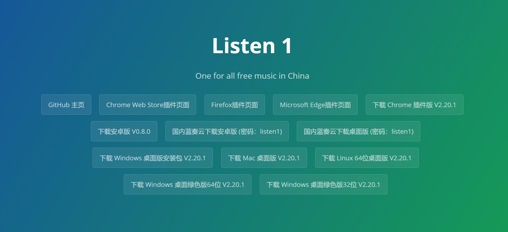

作为开发者，上班时候听一听音乐，屏蔽噪音。或者缓解压力都很好。

由于各个平台之间的限制，曲库是不完全的，我们需要下载多个平台听自己喜欢的音乐。

这里我要推荐(感谢) [Listen 1 音乐播放器](https://listen1.github.io/listen1/) 。

Listen 1可以搜索和播放来自网易云音乐，虾米，QQ音乐，酷狗音乐，酷我音乐，Bilibili，咪咕音乐网站的歌曲，让你的曲库更全面。

以下是该工具支持的平台：

如果你是个重度浏览器用户，不想要桌面应用，也可以下载浏览器插件。仅仅只有 2M 大小。

下载它然后享受各个平台的音乐曲库。