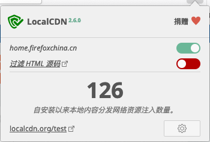
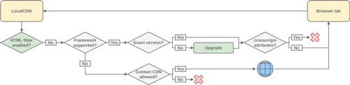
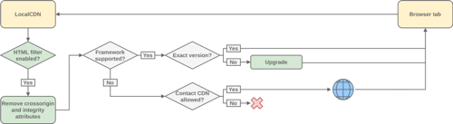
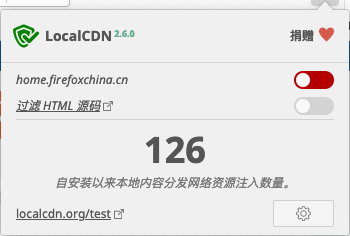

## 1. 什么是 LocalCDN？

LocalCDN 是一款强大的浏览器扩展工具，专为提升网站加载速度和保护用户隐私而设计。与传统 CDN（内容分发网络）不同，LocalCDN 直接在本地计算机中提供常见的 JavaScript 和 CSS 库，彻底消除了对第三方 CDN 服务器的依赖。

**主要价值和优势：**
- **显著提升网站加载速度**：本地资源加载速度远超远程 CDN 资源
- **降低网络流量消耗**：减少重复下载相同资源的需求
- **保护用户隐私**：避免向第三方 CDN 服务器发送请求，防止用户行为被追踪
- **提高网站可访问性**：即使在网络条件不佳的情况下，也能快速加载网站核心功能
- **增强安全性**：减少对外部资源的依赖，降低潜在的安全风险

## 2. 工作原理详解

LocalCDN 的核心工作原理是**拦截并重定向**浏览器对第三方 CDN 资源的请求。当您访问一个网站时，该网站通常会从外部 CDN 服务器加载各种 JavaScript 库和 CSS 框架。LocalCDN 会检测这些请求，并在本地插件存储中查找相应的资源文件，然后直接提供给浏览器，完全绕过网络请求。

### 拦截与替换流程

1. 浏览器发起对第三方 CDN 资源的请求
2. LocalCDN 拦截该请求
3. 根据请求的 URL 和文件特征在本地数据库中查找匹配的资源
4. 如果找到匹配资源，直接从本地提供该资源
5. 如果未找到匹配资源，请求将正常发送到原始 CDN 服务器

## 3. 支持的 CDN 和资源库

LocalCDN 支持众多流行的 CDN 服务和前端资源库，以下是主要支持列表：

### 支持的 CDN 服务
- Google APIs (googleapis.com)
- Microsoft CDN (aspnetcdn.com)
- Cloudflare CDN
- Baidu CDN
- Sina App Engine CDN
- Upyun CDN

### 支持的 JavaScript 库
- Angular
- Backbone.js
- Dojo
- Ember.js
- ExtCore
- jQuery
- jQuery UI
- Modernizr
- MooTools
- PrototypeJS
- Scriptaculous
- SWFObject
- Underscore.js
- WebFont Loader

随着插件的更新，支持的库列表会不断扩展，建议定期更新插件以获取最新支持。

## 4. 安装与基本配置

### 支持的浏览器

虽然 LocalCDN 可用于基于 Chromium 的浏览器（如 Chrome、Edge、Brave 等），但其核心功能**在 Firefox 浏览器上最为完整**。某些高级功能（如 HTML 源码过滤）仅在 Firefox 上可用。

### 安装步骤

#### Firefox 浏览器
1. 访问 [Mozilla Add-ons 网站](https://addons.mozilla.org/zh-CN/firefox/addon/localcdn-fork-of-decentraleyes/)
2. 搜索 "LocalCDN"
3. 点击 "添加到 Firefox" 按钮完成安装

#### Chrome/Edge/Brave 浏览器
1. 访问 [Chrome 网上应用店](https://chrome.google.com/webstore/)
2. 搜索 "LocalCDN"
3. 点击 "添加至 Chrome"（或相应浏览器名称）按钮完成安装

### 基本设置

安装完成后，您可以通过点击浏览器工具栏中的 LocalCDN 图标来访问设置面板：

- **启用/禁用插件**：快速切换 LocalCDN 功能
- **查看统计信息**：了解已拦截和替换的资源数量
- **管理白名单**：为特定网站禁用 LocalCDN
- **配置高级选项**：根据需要调整插件行为

## 5. HTML 过滤功能详解

HTML 过滤是 LocalCDN 的一项强大功能，能够解决网站加载失败的常见问题。该功能**仅在 Firefox 浏览器上可用**，因为它依赖于 Firefox 专有的 `webRequest.filterResponseData` API。

### 为什么需要 HTML 过滤？

某些网站的 HTML 源代码中包含以下属性，这些属性会阻止 LocalCDN 正常工作：

- **crossorigin**：强制浏览器忽略其他来源的资源
- **integrity**：为 JavaScript 库提供哈希值进行验证，但 LocalCDN 可能提供不同版本的库，导致哈希不匹配

### 启用 HTML 过滤

1. 点击浏览器工具栏中的 LocalCDN 图标
2. 进入插件设置
3. 找到并启用 "过滤 HTML 源码" 选项

### 效果对比

开启 HTML 过滤前后的效果对比：

**未使用 HTML 过滤时**：

**使用 HTML 过滤时**：

通过对比可以看到，启用 HTML 过滤后，LocalCDN 能够成功拦截更多的 CDN 请求，显著提升网站加载速度。

## 6. 浏览器兼容性与限制

| 浏览器 | 基本功能支持 | HTML 过滤支持 | 最佳体验 |
|-------|------------|-------------|---------|
| Firefox | ✓ | ✓ | ✔️ 推荐 |
| Chrome | ✓ | ✗ | 有限功能 |
| Edge (Chromium) | ✓ | ✗ | 有限功能 |
| Brave | ✓ | ✗ | 有限功能 |
| Safari | 不支持 | 不支持 | 不推荐 |

### 主要限制

1. **HTML 过滤**：仅 Firefox 浏览器支持完整的 HTML 源码过滤功能
2. **资源版本匹配**：LocalCDN 提供的库版本可能与网站请求的版本不完全一致
3. **动态加载的资源**：某些通过 JavaScript 动态加载的资源可能无法被拦截

## 7. 处理网站兼容性问题

尽管 LocalCDN 努力提供最好的兼容性，但某些网站可能会因为 LocalCDN 的资源替换而出现问题。以下是常见问题的解决方法：

### 网站显示空白或功能异常

1. **禁用当前网站的 LocalCDN**
   - 点击 LocalCDN 图标
   - 选择 "禁用当前网站的 LocalCDN"
   - 刷新页面查看效果

   

2. **启用 HTML 过滤**（仅 Firefox）
   - 进入插件设置
   - 开启 "过滤 HTML 源码" 选项
   - 刷新页面

3. **添加到白名单**
   - 如果问题持续存在，考虑将网站添加到 LocalCDN 的白名单中

## 8. 安全性与隐私考量

### 安全优势

- **减少攻击面**：降低对外部 CDN 的依赖，减少潜在的供应链攻击风险
- **防止资源篡改**：本地资源不会被网络中间人攻击篡改
- **版本控制**：插件维护者会确保提供的资源库是安全的版本

### 隐私保护

- **阻止跟踪**：避免向 Google、Microsoft 等第三方 CDN 服务器发送请求，防止这些服务通过 CDN 请求跟踪用户浏览行为
- **减少数据泄露**：降低因 CDN 提供商数据泄露而导致的隐私风险

### 使用注意事项

- 始终从官方渠道下载 LocalCDN 插件
- 定期更新插件以获取最新的安全修复和功能改进
- 对于处理敏感信息的网站，建议谨慎使用任何第三方插件

## 9. 使用技巧与最佳实践

### 提高兼容性的技巧

1. **优先使用 Firefox**：获得完整的 HTML 过滤功能支持
2. **合理配置白名单**：只对必要的网站禁用 LocalCDN
3. **定期更新插件**：确保获取最新支持的库和安全修复

### 性能优化建议

1. **配合广告拦截器使用**：与 uBlock Origin 等广告拦截器配合使用，进一步提升浏览体验
2. **关注资源统计**：通过插件统计信息了解哪些资源被频繁替换，评估性能提升效果
3. **为开发环境配置例外**：在进行 Web 开发时，考虑禁用 LocalCDN 以确保获取真实的资源加载情况

## 10. 与其他工具的对比

### 与 Decentraleyes 的关系

LocalCDN 是 Decentraleyes 插件的一个分支，主要区别在于：
- LocalCDN 支持更多的库和 CDN
- LocalCDN 提供了更强大的 HTML 过滤功能
- LocalCDN 的更新频率通常更高

### 与传统 CDN 的对比

| 特性 | LocalCDN | 传统 CDN |
|-----|---------|---------|
| 加载速度 | 极快（本地资源） | 快（但受网络影响） |
| 隐私保护 | 优秀（无第三方请求） | 有限（可能被追踪） |
| 离线可用性 | 部分支持 | 不支持 |
| 版本控制 | 由插件维护 | 由网站开发者控制 |
| 网络依赖 | 低 | 高 |

## 11. 总结

LocalCDN 是一款强大的浏览器扩展工具，通过将常用的 CDN 资源本地缓存，显著提升网站加载速度，同时保护用户隐私和减少网络依赖。虽然在不同浏览器上的功能支持有所差异，但在 Firefox 浏览器上能够提供最完整的体验。

通过正确配置和使用 LocalCDN，您可以：
- 享受更快的网站加载速度
- 减少网络流量消耗
- 增强在线隐私保护
- 降低对外部 CDN 服务的依赖

在享受这些好处的同时，请记住遵循安全最佳实践，并在遇到兼容性问题时灵活调整设置。

祝您使用愉快，提升您的浏览体验！ ⚠️ 请始终注意网络安全！
