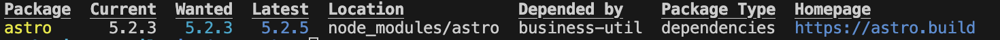
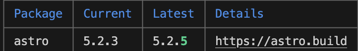

npm 的版本号为 semver 规范，由 [major, minor, patch] 三部分组成，其中

- major: 当你发了一个含有 Breaking Change 的 API
- minor: 当你新增了一个向后兼容的功能时
- patch: 当你修复了一个向后兼容的 Bug 时

## npm outdate

如果我们需要升级时，我们可以使用 outdated，发现有待更新的 npm 包。

```bash
npm outdated -l 
```




```bash
pnpm outdated -l
```



## npm-check-updates

使用 npm outdated 虽能发现需要升级版本号的 package，但仍然需要手动在 package.json 更改版本号进行升级。

此时就需要 npm-check-updates。

下载依赖

```bash
npm install -g npm-check-updates
```

检查所有项目依赖项的最新版本：

```bash
$ ncu
Checking package.json
[====================] 5/5 100%

 eslint             7.32.0  →    8.0.0
 prettier           ^2.7.1  →   ^3.0.0
 svelte            ^3.48.0  →  ^3.51.0
 typescript         >3.0.0  →   >4.0.0
 untildify          <4.0.0  →   ^4.0.0
 webpack               4.x  →      5.x

Run ncu -u to upgrade package.json
```

升级项目的包文件：

```bash
$ ncu -u
Upgrading package.json
[====================] 1/1 100%

 express           4.12.x  →   4.13.x

Run npm install to install new versions.

$ npm install      
# update installed packages and package-lock.json
```

使用 ncu -u 会升级到最新版。有可能引起破坏性更新，我们可以添加 --target 配置项。
- semver, 根据您指定的semver版本范围进行更新（major）
- minor，严格更新补丁程序和次要版本（minor）
- patch，严格更新补丁版本（patch）
- @next更新至标签上发布的版本 next(0.1.0->0.1.1-next.1)


注： lockfile 对于第三方库无效，所以如果你是一个第三方库开发者，勤加更新时更需要 npm-check-updates 工具。