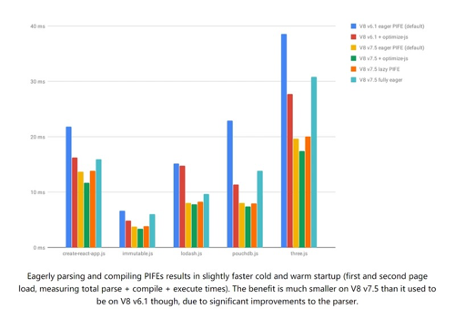

认识到这个库是在 v8 关于新版本的文章中，在 github 中被标记为 UNMAINTAINED 不再维护，但是了解与学习该库仍旧有其的价值与意义。该库的用法十分简单粗暴。居然只是把函数改为 IIFE (立即执行函数表达式)。

## 用法

```base
optimize-js input.js > output.js
```

输入为:

```ts
!function (){}()
function runIt(fun){ fun() }
runIt(function (){})
```

输出为：

```ts
!(function (){})()
function runIt(fun){ fun() }
runIt((function (){}))
```

## 原理

在 v8 引擎内部 (不仅仅是 V8，在这里以 v8 为例子)，位于各个编译器的前置 Parse 被分为 Pre-Parse 与 Full-Parse,Pre-Parse 会对整个 Js 代码进行检查，通过检查可以直接判定存在语法错误，直接中断后续的解析，在此阶段，Parse 不会生成源代码的 AST 结构。

```ts
// This is the top-level scope.
function outer() {
  // preparsed 这里会预分析
  function inner() {
    // preparsed 这里会预分析 但是不会 全分析和编译
  }
}


outer(); // Fully parses and compiles `outer`, but not `inner`.
```

但是如果使用 IIFE，v8 引擎直接不会进行 Pre-Parsing 操作，而是立即完全解析并编译函数。可以参考  [Blazingly fast parsing, part 2: lazy parsing](https://v8.dev/blog/preparser)

## 优势与缺陷

### 优势



快！即使在较新的 v8 引擎上，我们可以看到 optimize-js 的速度依然是最快的。更不用说在国内浏览器的版本远远小于 v8 当前版本。与后端 node 不同，前端的页面生命周期很短，越快执行越好。

### 缺陷

但是同样的，任何技术都不是银弹，直接完全解析和编译也会造成内存压力，并且该库也不是 js 引擎推荐的用法。相信在不远的未来，该库的收益也会逐渐变小，但是对于某些特殊需求，该库的确会又一定的助力。

