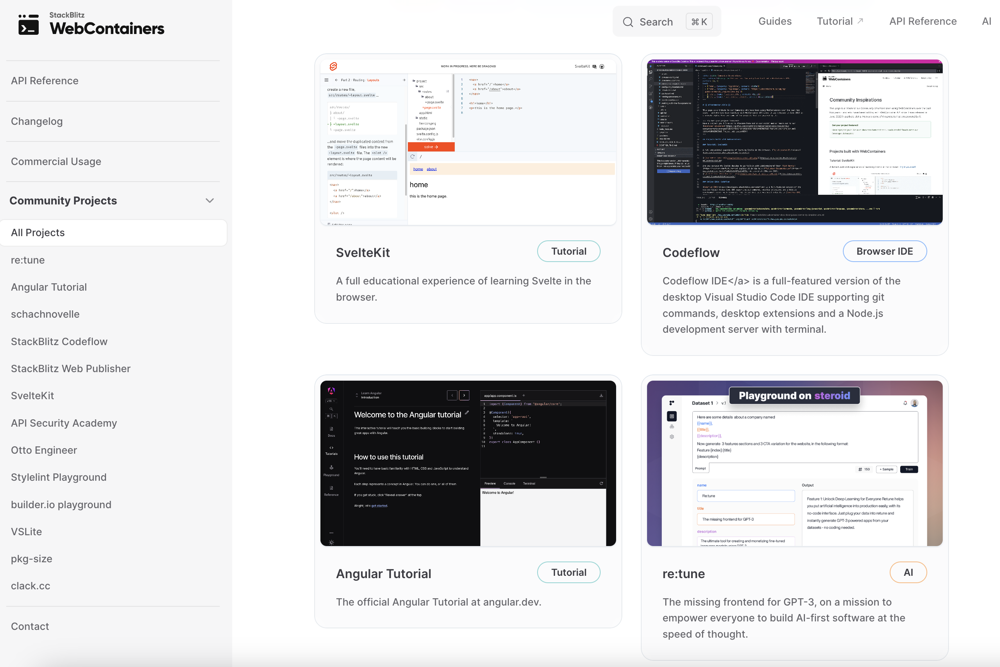

StackBlitz 的 [TutorialKit](https://tutorialkit.dev/) 能够帮助开发者毫不费力地创建交互式编码教程。

该库使用了 [WebContainers](https://webcontainers.io/)。WebContainers 是一个基于浏览器的运行时，用于完全在浏览器选项卡内执行 Node.js 应用程序和操作系统命令。

下图的工具均用 WebContainers 构建。

