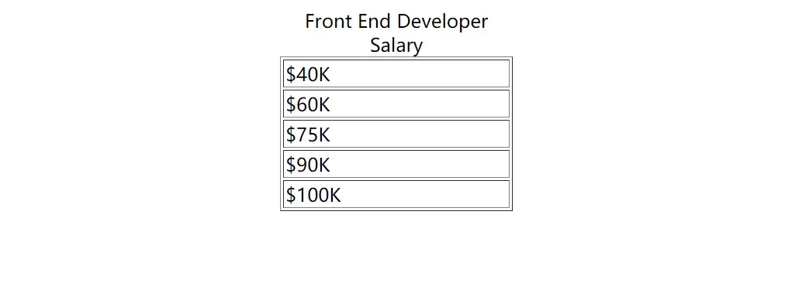
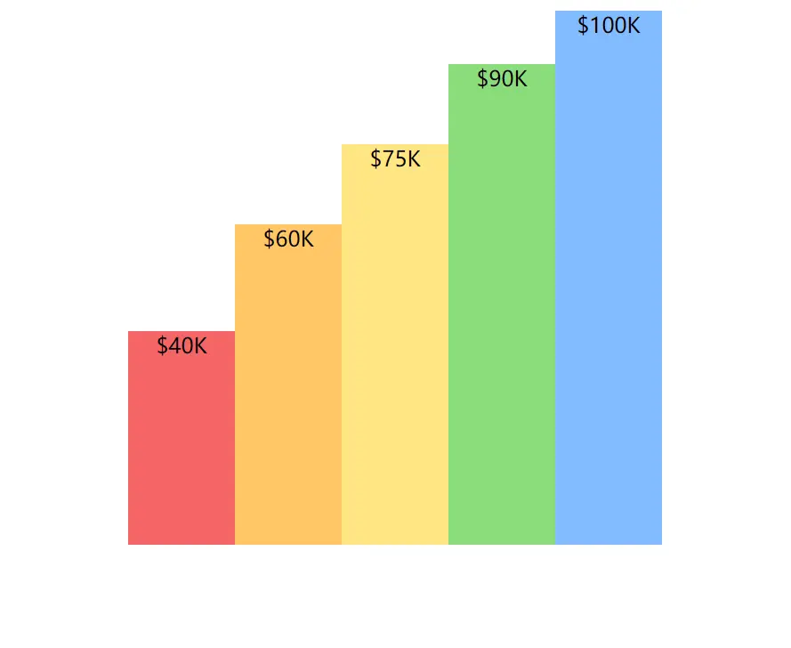

在没有遇到 Charts.css 之前, 我认为图表是离不开 JavaScript 计算的。但看到该库时候，我也是非常的欣喜。Charts.css 是一个 CSS 框架。它使用 CSS3 将 HTML 元素设置为图表样式，同时该库其中一个设计原则就是不会使用 JavaScript 代码（如果无法使用 CSS 完成，则不会成为框架的一部分 ）。当然，用户可以自行决定是否使用 JavaScript 。

## 例子

```html
<table border="1">
  <caption>
    Front End Developer Salary
  </caption>
  <tbody>
    <tr>
      <td>$40K</td>
    </tr>
    <tr>
      <td>$60K</td>
    </tr>
    <tr>
      <td>$75K</td>
    </tr>
    <tr>
      <td>$90K</td>
    </tr>
    <tr>
      <td>$100K</td>
    </tr>
  </tbody>
</table>
```

如图所显：



使用 Chart.css 之后:

```html
<table style="width: 400px;height: 400px" class="charts-css column">
  <caption>
    Front End Developer Salary
  </caption>
  <tbody>
    <tr>
      <td style="--size: calc( 40 / 100 )">$40K</td>
    </tr>
    <tr>
      <td style="--size: calc( 60 / 100 )">$60K</td>
    </tr>
    <tr>
      <td style="--size: calc( 75 / 100 )">$75K</td>
    </tr>
    <tr>
      <td style="--size: calc( 90 / 100 )">$90K</td>
    </tr>
    <tr>
      <td style="--size: calc( 100 / 100 )">$100K</td>
    </tr>
  </tbody>
</table>
```


