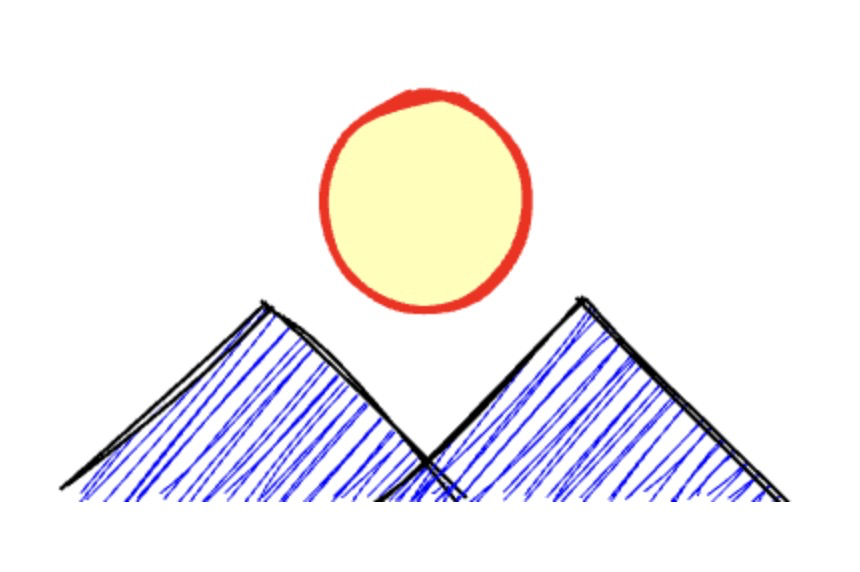

Rough.js 是一个小型 （<9 kB） 图形库，可让您以类似 手绘的粗略样式进行绘制。该库定义用于绘制线条、曲线、圆弧、多边形、圆和椭圆的基元。它还支持绘制 SVG 路径 。

Rough.js 适用于 Canvas 和 SVG。

```js
const rc = rough.canvas(document.getElementById("canvas"));
const hillOpts = { roughness: 2.8, strokeWidth: 2, fill: "blue" };
rc.path("M76 256L176 156L276 256", hillOpts);
rc.path("M236 256L336 156L436 256", hillOpts);
rc.circle(256, 106, 105, {
  stroke: "red",
  strokeWidth: 4,
  fill: "rgba(255, 255, 0, 0.4)",
  fillStyle: "solid",
});
```

如图所示

